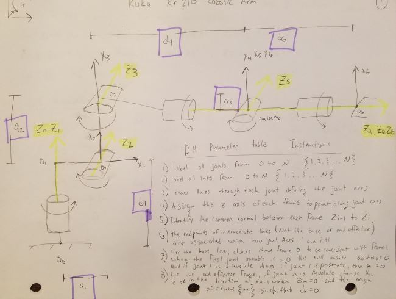
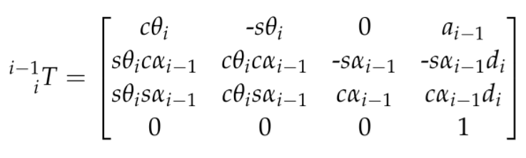
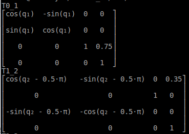
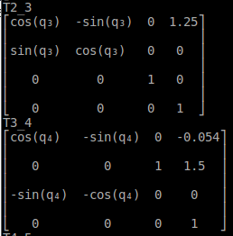
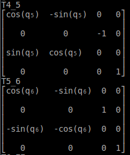
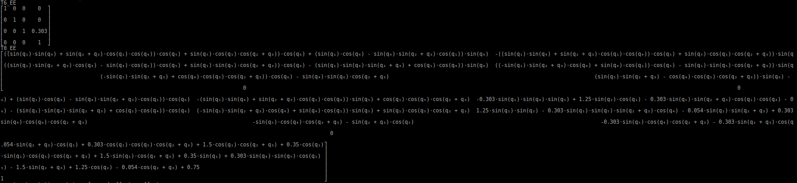
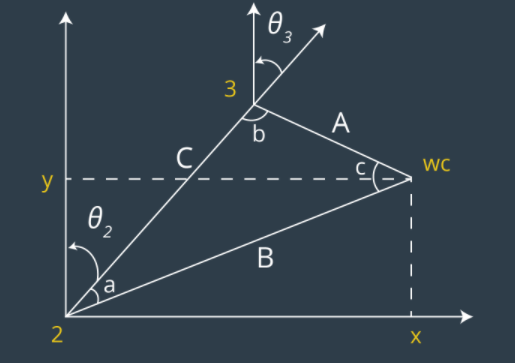
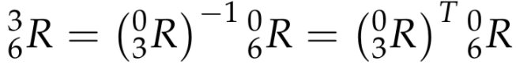
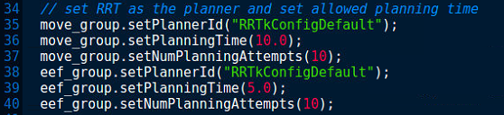
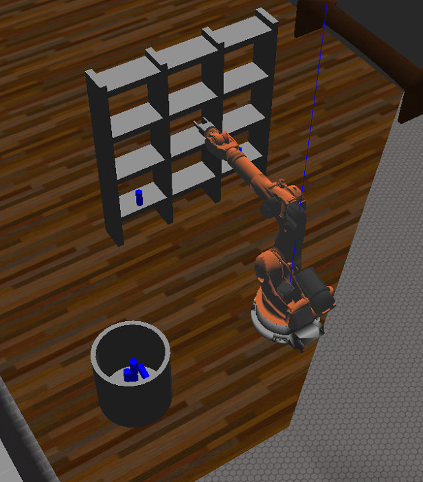

## Project: Kinematics Pick & Place

## [Rubric](https://review.udacity.com/#!/rubrics/972/view) Points
### Here I will consider the rubric points individually and describe how I addressed each point in my implementation.  

### Writeup / README

#### 1. Provide a Writeup / README that includes all the rubric points and how you addressed each one.  You can submit your writeup as markdown or pdf.  

## Kinematic Analysis
### Forward Kinematics
Your writeup should contain a DH parameter table with proper notations and description about how you obtained the table. Make sure to use the modified DH parameters discussed in this lesson. Please add an annotated figure of the robot with proper link assignments and joint rotations (Example figure provided in the writeup template). It is strongly recommended that you use pen and paper to create this figure to get a better understanding of the robot kinematics.

The purpose of the pick and place project was to have the student learn about serial manipulators and how to perfrom forward and inverse kinematics.  The Modified DH paramter tabel was constructed with the instructions from the Udacity lectures. The steps presensented in the lecture follow as:

#### 1) label all joints from 0 to N
#### 2) label all links from 0 to N
#### 3) Draw lines through each joint defining the joint axes.
#### 4) Assign the z axis of each frame to point along gjoint axes.
#### 5) Idenfigy the common normal between each frame z_i-1 to z_i
#### 6) Th eendpoints of th intermeiate links are associated with thwo joint axes i and i_+1
#### 7) For the base link, always choose frame 0 to be conicident with frame 1 when the first joint variable is = 0 thiw will sensure a_0 = alpha_0 and if joint 1 is a revolute d1 = 0, if joint 1 is prismatic, then theta_1 = 0
#### 8) For the end effector fram, if joint n is revolute, choose X-N to be in the direction of x_n-1 when theta_n=0 and the origin of fram n such tha d_n = 0

The a paramaters of the DH table consist of 4 unique properties of the model that describe the orienation of each link of the robot system.  The distance between the z_i-1 to z_i.  The d paramters represent the distance between x_i-1 to x_i .  The alpha values or twist angles are the measured angles between z_i-1 and z_i measured about the x_i-1 axis.  The theta parameters represent the twist angles of the revolute joints.  Once all the parameteres have been obtained a generic homogenous transformtation matrix can be used to calculate all of the transformation matrices between each link.  When combiune these rotation matrices can compute and end effector postion if all the joint angles are supplied.  

### 6 dof schematic

### Generic DH transformation matrix

#### 2. Using the DH parameter table you derived earlier, create individual transformation matrices about each joint. In addition, also generate a generalized homogeneous transform between base_link and gripper_link using only end-effector(gripper) pose.

Links | alpha(i-1) | a(i-1) | d(i-1) | theta(i)
--- | --- | --- | --- | ---
0->1 | 0 | 0 | .75 | q1
1->2 |-pi/2| .35 | 0 | q2-pi/2 
2->3 | 0 | 1.25 | 0 | q3
3->4 |-pi/2| -.054 | 1.50 | q4
4->5 | pi/2| 0 | 0 | q5
5->6 |-pi/2| 0 | 0 | q6
6->EE | 0 | 0 | .303 | q7

### Transformation matrix frame 0 to 2

### Transformation matrix frame 2 to 4

### Transformation matrix frame 4 to 6

### Transformation matrix frame 0 to 2

### Inverse Kinematics
The approach used for finding the joing angles of the robotic arm as a function of the end effector postion consisted of breaking the robot into two seperate parts.  The wrist center comprised of 3 revolute joints and the first 3 joints of the robot leading up to the wrist center.  Although numerical methods exist to compute all 6 joint angles it can be difficult to arrive at the correct set of solutions without an accurate guess.  Computational time wwould be a consideration as well. There will be multiple answers for each joint angle but the joints themselves impose their own constraints depending on the joint type ie. (does the joint move in that direction or past a certain degree limit).  Because of these limitations and ease of calculation an analytical or cloed form solution was used.  Mapping the geometry of the first 3 joints or up to the wrist center one can find the joint angles with simple geometry.  Once the first three joint angles have been found, matrix multiplication will yield the last 3 joint angles.  This equation is shown below that the transpose of the rotation matrix from 0 to 3 muliplied with the Rotatio matrix from 0 to 6 will yield the last 3 joint angles.  

Finding the exaxt postion of the wrtist center required additional rotations to the transformation matrices derrived from the DH parameter table.  This was due to an offset between the gripper frame and frame 6.  An additional roation of 180 degrees around the z axis and -90 degree rotation about the y axis aligned these two frames.  

### Frame 0 to 3 inverse kinematic diagram

### Inverse kinematic frame 3 to EE

### Project Implementation
using the safe_spanwer script the gazebo, ros master, Rviz environments are brought up.  I had to leave the computer completely alone when allowing gazebo to start up.  It seemed like each time I tried to operate while gazebo was starting up it would crash and the process had to be completed again.  After these environemtn were started the IK_servery scripts was run.  this scripts purpose was to receive the individual end effector postions from Moveit motion planning and calculate the joint angles need to place the end effector in the correct position.  Initially the two program worked well together with the pick and place operation completed successfully, but the path that moveit would plan would sometime deviate wildly from what the shortest path actually was.  I searched and found within the moveit::planning interface::MoveGroup class there was an option to set the minimum number of path planning attempts to calculate and find the shortest path.  I set this minimum number to 10 for both the move group and the end effector group.  After adding this piece of code to the trajectory_sampler.cpp file the ROS environment was refreshed using catkin_make to rebuild.  After this moveit did a resonably good job with calculating the minimum distance between the start and end pose.  Running the simulation through 10 cycles of pick an place operations the robot faile dto pick up the cylinder one time.  This was during the period of time where the continue button was pushed and the robot acted without user input.  A sleep period was added to the trajectory_sampler file to prevent the gripper arm from moving before the gripper had to time to fully contract.    

### trajectory_sampler code addition

trajectory_sampler_snip.PNG
### Project Completion

