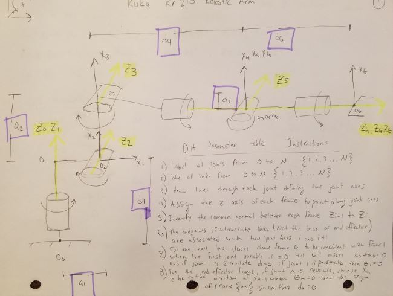
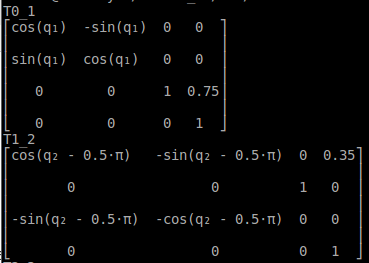
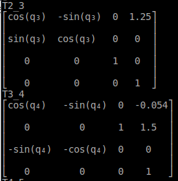
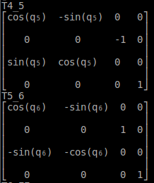
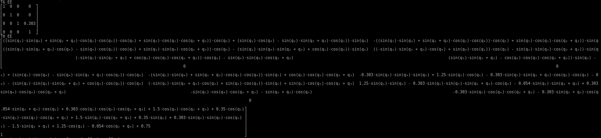

## Project: Kinematics Pick & Place

## [Rubric](https://review.udacity.com/#!/rubrics/972/view) Points
### Here I will consider the rubric points individually and describe how I addressed each point in my implementation.  

### Writeup / README

#### 1. Provide a Writeup / README that includes all the rubric points and how you addressed each one.  You can submit your writeup as markdown or pdf.  

## Kinematic Analysis
### Forward Kinematics
Your writeup should contain a DH parameter table with proper notations and description about how you obtained the table. Make sure to use the modified DH parameters discussed in this lesson. Please add an annotated figure of the robot with proper link assignments and joint rotations (Example figure provided in the writeup template). It is strongly recommended that you use pen and paper to create this figure to get a better understanding of the robot kinematics.

The purpose of the pick and place project was to have the student learn about serial manipulators and how to perfrom forward and inverse kinematics.  The Modified DH paramter tabel was constructed with the instructions from the Udacity lectures. The steps presensented in the lecture follow as:

#### 1) label all joints from 0 to N
#### 2) label all links from 0 to N
#### 3) Draw lines through each joint defining the joint axes.
#### 4) Assign the z axis of each frame to point alon gjoint axes.
#### 5) Idenfigy the common normal between each frame z_i-1 to z_i
#### 6) Th eendpoints of th intermeiate links are associated with thwo joint axes i and i_+1
#### 7) For the base link, always choose frame 0 to be conicident with frame 1 when the first joint variable is = 0 thiw will sensure a_0 = alpha_0 and if joint 1 is a revolute d1 = 0, if joint 1 is prismatic, then theta_1 = 0
#### 8) For the end effector fram, if joint n is revolute, choose X-N to be in the direction of x_n-1 when theta_n=0 and the origin of fram n such tha d_n = 0

The a paramaters of the DH table consist of 4 unique properties of the model that describe the orienation of each link of the robot system.  The distance between the z_i-1 to z_i.  The d paramters represent the distance between x_i-1 to x_i .  The alpha values or twist angles are the measured angles between z_i-1 and z_i measured about the x_i-1 axis.  The theta parameters represent the twist angles of the revolute joints.  Once all the parameteres have been obtained a generic homogenous transformtation matrix can be used to calculate all of the transformation matrices between each link.  When combiune these rotation matrices can compute and end effector postion if all the joint angles are supplied.  

### 6 dof schematic

### Inverse Kinematics

#### 2. Using the DH parameter table you derived earlier, create individual transformation matrices about each joint. In addition, also generate a generalized homogeneous transform between base_link and gripper_link using only end-effector(gripper) pose.

Links | alpha(i-1) | a(i-1) | d(i-1) | theta(i)
--- | --- | --- | --- | ---
0->1 | 0 | 0 | .75 | q1
1->2 |-pi/2| .35 | 0 | q2-pi/2 
2->3 | 0 | 1.25 | 0 | q3
3->4 |-pi/2| -.054 | 1.50 | q4
4->5 | pi/2| 0 | 0 | q5
5->6 |-pi/2| 0 | 0 | q6
6->EE | 0 | 0 | .303 | q7

### Transformation matrix frame 0 to 2

### Transformation matrix frame 2 to 4

### Transformation matrix frame 4 to 6

### Transformation matrix frame 0 to 2

#### 3. Decouple Inverse Kinematics problem into Inverse Position Kinematics and inverse Orientation Kinematics; doing so derive the equations to calculate all individual joint angles.

And here's where you can draw out and show your math for the derivation of your theta angles. 

![alt text][image2]

### Project Implementation

#### 1. Fill in the `IK_server.py` file with properly commented python code for calculating Inverse Kinematics based on previously performed Kinematic Analysis. Your code must guide the robot to successfully complete 8/10 pick and place cycles. Briefly discuss the code you implemented and your results. 

Here I'll talk about the code, what techniques I used, what worked and why, where the implementation might fail and how I might improve it if I were going to pursue this project further.  

And just for fun, another example image:
![alt text][image3]

